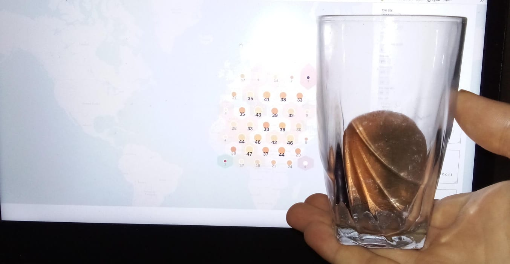

d3_dymaxion
===========

Continued effort to get some usable visualization outputs.

This project explores the visualization of geographic data using the Dymaxion projection, a method developed by Buckminster Fuller. The Dymaxion projection minimizes distortion of the Earth's surface, providing a more accurate representation than traditional map projections like the Mercator. We leverage D3.js, a powerful JavaScript library for producing dynamic, interactive data visualizations in web browsers, and integrate OpenLayers for map rendering. This README outlines the project setup, key concepts, and future directions for enhancing the visualization experience.


<details>
<summary>Prerequisites (Dymaxion, Mercator, H3 Grid)</summary>


---

## Key Concepts

### Dymaxion Projection
The Dymaxion projection is a way to display the entire Earth's surface on a flat plane with minimal distortion. It unfolds the globe into a nearly contiguous landmass, offering a unique perspective on Earth's geography. [Wikipedia: Dymaxion Map](https://en.wikipedia.org/wiki/Dymaxion_map)

### OpenLayers
OpenLayers is an open-source JavaScript library for displaying map data in web browsers. It provides tools for rendering various map projections, including the Dymaxion projection. [Wikipedia: OpenLayers](https://en.wikipedia.org/wiki/OpenLayers)

### Mercator Projection
The Mercator projection is a cylindrical map projection presented by the Flemish geographer and cartographer Gerardus Mercator in 1569. It is widely used for navigation charts and maps but introduces significant distortion, especially near the poles. [Wikipedia: Mercator Projection](https://en.wikipedia.org/wiki/Mercator_projection)

### H3 Grid System
The H3 grid system is a hierarchical spatial data structure that partitions the world into hexagonal cells. Developed by Uber, it offers a versatile framework for geospatial analysis and visualization. [Wikipedia: H3 (geospatial indexing system)](https://en.wikipedia.org/wiki/H3_(geospatial_indexing_system))

---

This introduction provides a foundation for understanding the project's goals, key technologies, and methodologies. It highlights the importance of choosing the right projection for geospatial visualization and introduces the concept of using a global grid system for detailed analysis.

</details>

## Setup and Usage

To run the project:


```shell
asdf local nodejs 18.17 ; # tab tab ;)
npx endpoint-ei --server .
firefox localhost:3000/index.html
```
This documentation outlines the process of setting up a local development environment to visualize geographic data using the Dymaxion projection and explores alternative projections, such as the Collignon butterfly projection, for enhanced readability and minimal distortion.

For detailed insights and visual examples, the project includes comparisons between the Dymaxion and Mercator projections, demonstrating the advantages of using less distorted, more accurate representations of the Earth's surface.


## Da Deets


I have added a openlayers implementation i found and modified the data to work

note i think future work should look into
the https://www.jasondavies.com/maps/collignon-butterfly/

This is simpler and may be more viewer friendly


above you can see the openlayers version, not how the latitude lones connect.  
Im not sure about the details of antarctica it seems there might be a bug in the system or
many



Above is a photo i took to help explain the mercator projection and why there is
distortion .
notice the area of the first band of a sphere is smaller then the second.

```shell
proof: 
take the north poal of area 0 
one step away then walk in a circle its more then 0 .. so on 

at the sextreme 0 area is maped to a full row ie infinate distortion.
```

# Conclusion

Ok just need to document this a bit

https://www.uber.com/en-IN/blog/h3/
What@where ... where is a H3 grid location that is based on the dymaxion projection which
has minimal distortion

Conclusion sure it's ok
What's the best projection for readability with no distortion.
A freken load just show people a globe .. if you need to show the whole world use
butterfly protection or sure dymaxion is good. But point is we don't need to render it
just show a globe instead. But the grid goes down to about a one meter resolution and has
some nice properties.

Personaly of build it with the butterfly projection and triangle subdivisions;)

Fiddling with implementing Protovis' dymaxion projection in D3.

# Thanks

Also someone pls make this all one clean lib XD

Code hacked together from:
http://mbostock.github.com/protovis/ex/dymax.html
http://bl.ocks.org/3712397
https://indiemaps.com/projects/openlayers-dymaxion/examples/world_dymaxion/

